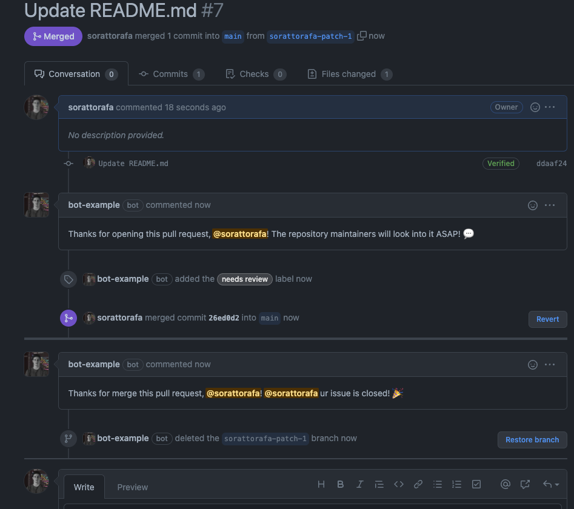

# EXEMPLO DE BOT PARA GITHUB

## AUTORES

### Rafael Soratto (@sorattorafa)
### Victor Daniel Pires (@victordmp)
### Emica Oliveira Costa (@euEmica)

## Funcionamento 

## Como executar

 - `python3 app.py`
 - `smee -u https://smee.io/<youridhere> --port 5000`